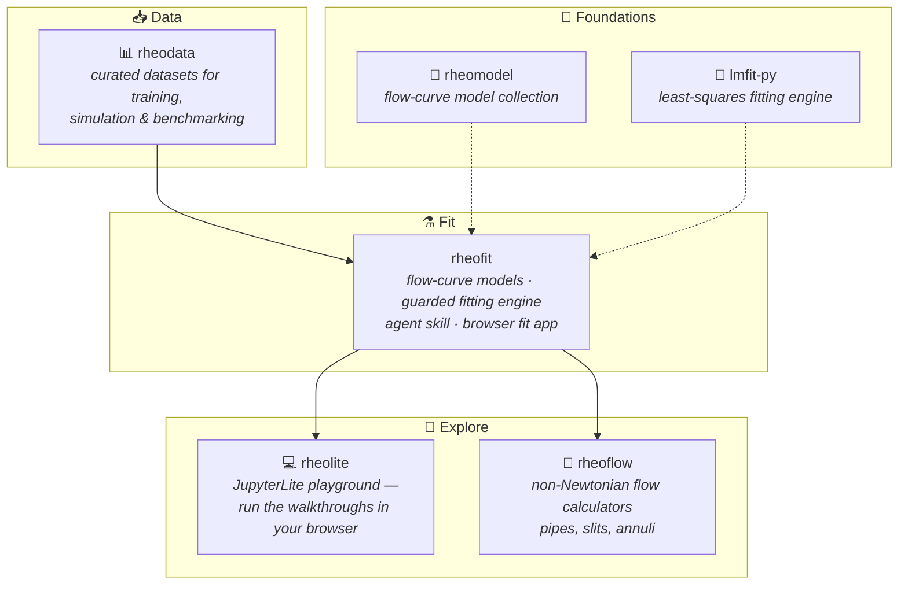

# rheopy ⚗️

**Open rheology, end to end** — from curated measurements to guarded model fits
to in-browser exploration. Every tool ships with the knowledge to use it:
libraries bundle agent skills, docs stay in sync with code.

## The pieces

| Repository | What it is |
|---|---|
| [rheodata](https://github.com/rheopy/rheodata) | 📊 Pip-installable library of quality-checked rheology datasets — literature & community, each with provenance, sample and measurement metadata |
| [rheofit](https://github.com/rheopy/rheofit) | ⚗️ Flow-curve fitting library: nine models, guarded fitting engine, an agent skill that ships with the package, and a browser fit app |
| [rheolite](https://github.com/rheopy/rheolite) | 💻 JupyterLite playground reproducing the rheofit walkthroughs entirely in the browser |
| [rheoflow](https://github.com/rheopy/rheoflow) | 🌊 Engineering calculators for non-Newtonian flow in pipes, slits and annuli |
| [rheomodel](https://github.com/rheopy/rheomodel) | 📐 Collection of rheology flow-curve models |
| [lmfit-py](https://github.com/rheopy/lmfit-py) | 🔧 Fork of the lmfit least-squares minimization library |

## Philosophy

*Ship the skill with the tool.* Each library carries its own agent skill and
documentation generated from the same source of truth — so the knowledge of
how to use it can never drift from the code itself. Data you cannot trust is
worse than no data; every dataset and every fit carries its provenance.
